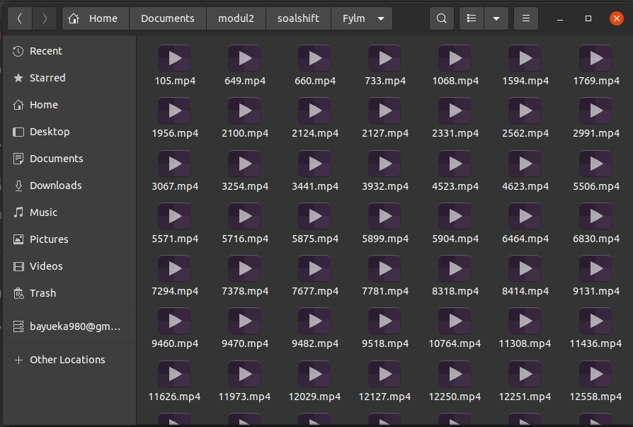

# Soal Shift Modul 2 Kelompok A02 2021

Nama Anggota Kelompok:
1. Bayu Eka Prawira         (05111940000042)
2. Putu Ananda Satria Adi   (05111940000113)

## Soal 1
### Narasi Soal
Pada suatu masa, hiduplah seorang Steven yang hidupnya pas-pasan. Steven punya pacar, namun sudah putus sebelum pacaran. Ketika dia galau memikirkan mantan, ia selalu menonton https://www.youtube.com/watch?v=568DH_9CMKI untuk menghilangkan kesedihannya. 

Di lain hal Steven anak yang tidak amat sangat super membenci matkul sisop, beberapa jam setelah diputus oleh pacarnya dia menemukan wanita lain bernama Stevany, namun Stevany berkebalikan dengan Steven karena menyukai sisop. Steven ingin terlihat jago matkul sisop demi menarik perhatian Stevany.

Pada hari ulang tahun Stevany, Steven ingin memberikan Stevany zip berisikan hal-hal yang disukai Stevany. Steven ingin isi zipnya menjadi rapi dengan membuat folder masing-masing sesuai extensi. 

### 1a
**Soal**</br>
Dikarenakan Stevany sangat menyukai huruf **Y**, Steven ingin nama folder-foldernya adalah **Musyik** untuk mp3, **Fylm** untuk mp4, dan **Pyoto** untuk jpg 
</br>

**Penjelasan**</br>
Pada soal 1 poin a, kita diminta untuk membuat tiga folder untuk menyimpan file-file yang akan didownload pada soal selanjutnya. Karena tidak diperbolehkan menggunakan fungsi mkdir() yang ada di bahasa C, maka kami menggunakan cara sebagai berikut.
```C
void donlotDanBuatFolder()
{
    pid_t buatFolder;
    int waitt;
    buatFolder = fork();
    if(buatFolder < 0)
        exit(EXIT_FAILURE);
    if(buatFolder == 0)
    {
        makeFolder();
    }
    ...
}

void makeFolder()
{
    char *argv[] = {"mkdir", "-p", "Musyik", "Fylm", "Pyoto", NULL};
    execv("/bin/mkdir", argv);
}
```
Dikarenakan fungsi exec setelah mengeksekusi program langsung exit, maka menggunakan fork() agar semua bisa berjalan seperti program biasanya.

```C
void donlotDanBuatFolder()
{
    pid_t buatFolder;
    int waitt;
    buatFolder = fork();
    if(buatFolder < 0)
        exit(EXIT_FAILURE);
    if(buatFolder == 0)
    {
        makeFolder();
    }
    ...
}
```
Di dalam fungsi tersebut, fungsi ```makefolder()```, dipanggil di dalam child sehingga dijalankan terdahulu sebelum yang ada di dalam parent dijalankan.
```C
void makeFolder()
{
    char *argv[] = {"mkdir", "-p", "Musyik", "Fylm", "Pyoto", NULL};
    execv("/bin/mkdir", argv);
}
```
Execv digunakan untuk menjalankan perintah bahasa _shell_ di dalam bahasa C.
</br>

**Output**</br>
 

### 1b
**Soal**</br>
Untuk musik Steven **mendownloadnya** dari link di bawah, film dari link di bawah lagi, dan foto dari link dibawah juga :). \
link download : \
1. Film : https://drive.google.com/uc?id=1ktjGgDkL0nNpY-vT7rT7O6ZI47Ke9xcp&export=download
2. Musik : https://drive.google.com/uc?id=1ZG8nRBRPquhYXq_sISdsVcXx5VdEgi-J&export=download
3. Foto : https://drive.google.com/uc?id=1FsrAzb9B5ixooGUs0dGiBr-rC7TS9wTD&export=download
</br>

**Kode Program**
```C
void donlotDanBuatFolder()
{
    pid_t buatFolder;
    int waitt;
    buatFolder = fork();
    if(buatFolder < 0)
        exit(EXIT_FAILURE);
    if(buatFolder == 0)
    {
        makeFolder();
    }
    else
    {
        while((wait(&waitt)) > 0);
        pid_t donlotF;
        int waitt1;
        donlotF = fork();
        if(donlotF < 0)
            exit(EXIT_FAILURE);
        if(donlotF == 0)
            downloadFilm();
        else
        {
            while((wait(&waitt1)) > 0);
            pid_t donlotM;
            int waitt2;
            donlotM = fork();
            if(donlotM < 0)
                exit(EXIT_FAILURE);
            if(donlotM == 0)
                downloadMusik();
            else
            {
                while((wait(&waitt2)) > 0);
                downloadPhoto();
            }
        }
    }
}

void downloadFilm()
{
    execl("/bin/wget", "wget", "--no-check-certificate", "https://drive.google.com/uc?id=1ktjGgDkL0nNpY-vT7rT7O6ZI47Ke9xcp&export=download", 
            "-qO", "Film_for_Stevany.zip", (char *)NULL);
}

void downloadMusik()
{
    execl("/bin/wget", "wget", "--no-check-certificate", "https://drive.google.com/uc?id=1ZG8nRBRPquhYXq_sISdsVcXx5VdEgi-J&export=download", 
            "-qO", "Musik_for_Stevany.zip", (char *)NULL);
}

void downloadPhoto()
{  
    execl("/bin/wget", "wget", "--no-check-certificate", "https://drive.google.com/uc?id=1FsrAzb9B5ixooGUs0dGiBr-rC7TS9wTD&export=download", 
            "-qO", "Photo_for_Stevany.zip", (char *)NULL);
}
```
**Penjelasan** \
Untuk susunan pengerjaan, setiap fungsi untuk mendownload saya memasukkannya ke dalam parent setelah membuat folder yang di dalam parent tersebut, diinisialisasi child untuk mendownload film, di dalam parent-2nya diinisialisasi child lagi untuk mendownload musik dan parent terakhir digunakan untuk mendownload foto. Jadi proses berjalan secara bertahap atau tidak secara bersamaan dalam satu waktu.
</br>

**Output**</br>


### 1c
**Soal**</br>
Steven tidak ingin isi folder yang dibuatnya berisikan zip, sehingga perlu **meng-extract-nya** setelah didownload.
</br>

**Kode Program**
```C
void jalaninYak()
{
    ...
    else
    {
        while((wait(&status)) > 0);
        unzipDuls();
    }
}

void unzipDuls()
{
    pid_t unzipF;
    int wait1;
    unzipF = fork();
    if(unzipF < 0)
        exit(EXIT_FAILURE);
    if(unzipF == 0)
        unzipFilm();
    else
    {
        while((wait(&wait1)) > 0);
        pid_t unzipM;
        int wait2;
        unzipM = fork();
        if(unzipM < 0)
            exit(EXIT_FAILURE);
        if(unzipM == 0)
            unzipMusik();
        else
        {
            while((wait(&wait2)) > 0);
            pid_t unzipP;
            int wait3;
            unzipP = fork();
            if(unzipP < 0)
                exit(EXIT_FAILURE);
            if(unzipP == 0)
                unzipPhoto();
            else
            {
                while((wait(&wait3)) > 0);
                terusMove();
            }
        }
    }
}

void unzipFilm()
{
    char *argv[] = {"unzip", "./Film_for_Stevany.zip", NULL};
    execv("/bin/unzip", argv);
}

void unzipMusik()
{
    char *argv[] = {"unzip", "./Musik_for_Stevany.zip", NULL};
    execv("/bin/unzip", argv);
}

void unzipPhoto()
{
    char *argv[] = {"unzip", "./Photo_for_Stevany.zip", NULL};
    execv("/bin/unzip", argv);
}
```

**Penjelasan**</br>
Pada poin C, kita diminta untuk mengextract isi dari semua file .zip yang telah terdownload ke dalam directory path yang sama dengan file .c. Proses mengextract terjadi secara seri sehingga tidak secara bersamaan mengextractnya.

**Output**</br>


### 1d
**Soal**</br>
**Memindahkannya** ke dalam folder yang telah dibuat (hanya file yang dimasukkan).
</br>

**Kode Program**</br>
```C
void terusMove()
{
    pid_t moveF;
    int film;
    moveF = fork();
    if(moveF < 0)
        exit(EXIT_FAILURE);
    if(moveF == 0)
        moveFilm();
    else
    {
        while((wait(&film)) > 0);
        pid_t moveM;
        int musik;
        moveM = fork();
        if(moveM < 0)
            exit(EXIT_FAILURE);
        if(moveM == 0)
            moveMusik();
        else
        {
            while((wait(&musik)) > 0);
            pid_t moveP;
            int photo;
            moveP = fork();
            if(moveP < 0)
                exit(EXIT_FAILURE);
            if(moveP == 0)
                movePhoto();
                        
            else
            {
                while((wait(&photo)) > 0);
                finishing();
            }
        }
    }
}

void moveFilm()
{
    DIR *dp;
    struct dirent *ep;

    dp = opendir("./FILM");

    if (dp != NULL) {
      while ((ep = readdir (dp))) {
          if (strstr(ep->d_name,"mp4")) {
            char temp[100] = "./FILM/";
            char dest[100] = "./Fylm";
            int status;
            pid_t child_id = fork();

            strcat(temp, ep->d_name);
            
            if (child_id == 0) {
                char* argv[] = {"mv", temp, dest, NULL};
                execv("/usr/bin/mv", argv);
            }
          }
      }

      (void) closedir (dp);
    } else perror ("Couldn't open the directory");
}

void moveMusik()
{
    DIR *dp;
    struct dirent *ep;

    dp = opendir("./MUSIK");

    if (dp != NULL) {
      while ((ep = readdir (dp))) {
          if (strstr(ep->d_name,"mp3")) {
            char temp[100] = "./MUSIK/";
            char dest[100] = "./Musyik";
            int status;
            pid_t child_id = fork();

            strcat(temp, ep->d_name);
            
            if (child_id == 0) {
                char* argv[] = {"mv", temp, dest, NULL};
                execv("/usr/bin/mv", argv);
            }
          }
      }

      (void) closedir (dp);
    } else perror ("Couldn't open the directory");
}

void movePhoto()
{            
    DIR *dp;
    struct dirent *ep;

    dp = opendir("./FOTO");

    if (dp != NULL) {
      while ((ep = readdir (dp))) {
          //mv source destinasi
          if (strstr(ep->d_name,"jpg")) {
            char temp[100] = "./FOTO/";
            char dest[100] = "./Pyoto";
            int status;
            pid_t child_id = fork();

            strcat(temp, ep->d_name);
            
            if (child_id == 0) {
                char* argv[] = {"mv", temp, dest, NULL};
                execv("/usr/bin/mv", argv);
            }
          }
      }

      (void) closedir (dp);
    } else perror ("Couldn't open the directory");
}
```
**Penjelasan**</br>
Setelah proses pada poin D selesai, maka akan langsung berjalan proses memindahkan file-file yang ada dalam folder yang telah ter-unzip ke dalam folder yang telah dibuat pada poin A. Untuk direktori listing, saya menggunakan ```dirent```, sehingga dalam proses pemindahan file-filenya terjadi secara satu persatu. \
 Khusus pemindahan file foto, kita hanya perlu memindahkan file-file yang berformat .jpg.
</br>

**Output**</br>



### 1e
**Soal**</br>
Untuk memudahkan Steven, ia ingin semua hal di atas berjalan **otomatis** 6 jam sebelum waktu ulang tahun Stevany.
</br>

**Kode Program**</br>
```C
int main()
{
    /* Our process ID and Session ID */
    pid_t pid, sid;
        
    /* Fork off the parent process */
    pid = fork();
    if (pid < 0) {
        exit(EXIT_FAILURE);
    }
    /* If we got a good PID, then
       we can exit the parent process. */
    if (pid > 0) {
        exit(EXIT_SUCCESS);
    }
                
    /* Open any logs here */        
                
    /* Create a new SID for the child process */
    sid = setsid();
    if (sid < 0) {
        /* Log the failure */
        exit(EXIT_FAILURE);
    }
        
    /* Change the current working directory */
    chdir("home/bayuekap/Documents/modul2/soalshift/");
    
    /* Change the file mode mask */
    umask(0); 

    /* Close out the standard file descriptors */
    close(STDIN_FILENO);
    close(STDOUT_FILENO);
    close(STDERR_FILENO);
        
    /* Daemon-specific initialization goes here */
        
    /* The Big Loop */
    while (1) {
        jalaninYak();
        sleep(10); /* wait 10 seconds */
        break;
    }
   exit(EXIT_SUCCESS);
        
}

void jalaninYak()
{
    time_t rawtime;
    struct tm * timeinfo;
    char buffer [80];

    time (&rawtime);
    timeinfo = localtime (&rawtime);
    strftime (buffer, 80,"%m-%d_%H:%M",timeinfo);
    while(strcmp(buffer, "04-09_16:22") != 0)
    {
        sleep(2);
        rawtime = time(NULL);
        timeinfo = localtime(&rawtime);
        strftime (buffer, 80,"%m-%d_%H:%M",timeinfo);
    }
    pid_t child_id;
    int status;
    child_id = fork();
    if(child_id == 0)
        donlotDanBuatFolder();
    else
    {
        while((wait(&status)) > 0);
        unzipDuls();
    }
}
```

**Penjelasan**</br>
Soal meminta kita untuk berjalan secara otomatis di background, oleh karena itu, kita menggunakan Daemon. \
Untuk menyetel agar program berjalan pada waktu tertentu, maka digunakan header ```time.h``` dan untuk mengaturnya, kita mengubah format current date menjadi string yang nanti akan dibandingkan setiap 2 detik sekali apakah sudah memenuhi jam yang diinginkan apa belum, jika belum, maka program akan terus menyimpan waktu ke dalam sebuah variabel, dan jika sudah memenuhi, program akan menjalankan proses selanjutnya. Pada poin soal ini adalah 6 jam sebelum pukul 22.22 pada tanggal 9 April, sehingga terjadi pukul 16.22
</br>

**Output**</br>


### 1f
**Soal**</br>
Setelah itu pada **waktu** ulang tahunnya Stevany, semua folder akan di zip dengan nama **Lopyu_Stevany.zip** dan semua folder akan di **delete**(sehingga hanya menyisakan .zip).
</br>

**Kode Program**</br>
```C
void finishing()
{
    time_t rawtime;
    struct tm * timeinfo;
    char buffer [80];

    time (&rawtime);
    timeinfo = localtime (&rawtime);
    strftime (buffer, 80,"%m-%d_%H:%M",timeinfo);
    while(strcmp(buffer, "04-09_22:22") != 0)
    {
        sleep(2);
        rawtime = time(NULL);
        timeinfo = localtime(&rawtime);
        strftime (buffer, 80,"%m-%d_%H:%M",timeinfo);
    }
    pid_t tutup1;
    int yah1;
    tutup1 = fork();
    if(tutup1 < 0)
        exit(EXIT_FAILURE);
    if(tutup1 == 0)
        delFilm();
    else
    {
        while((wait(&yah1)) > 0);
        pid_t tutup2;
        int yah2;
        tutup2 = fork();
        if(tutup2 < 0)
            exit(EXIT_FAILURE);
        if(tutup2 == 0)
            delFoto();
        else
        {
            while((wait(&yah2)) > 0);
            pid_t tutup3;
            int yah3;
            tutup3 = fork();
            if(tutup3 < 0)
                exit(EXIT_FAILURE);
            if(tutup3 == 0)
                delMusik();
            else
            {
                while((wait(&yah3)) > 0);
                bikinZip();
            }
        }
    }
}

void bikinZip()
{
    pid_t zi1;
    int yi1;
    zi1 = fork();
    if(zi1 < 0)
        exit(EXIT_FAILURE);
    if(zi1 == 0)
        ngezip();
    else
    {
        while((wait(&yi1)) > 0);
        pid_t zi2;
        int yi2;
        zi2 = fork();
        if(zi2 < 0)
            exit(EXIT_FAILURE);
        if(zi2 == 0)
            delFylm();
        else
        {
            while((wait(&yi2)) > 0);
            pid_t zi3;
            int yi3;
            zi3 = fork();
            if(zi3 < 0)
                exit(EXIT_FAILURE);
            if(zi3 == 0)
                delMusyik();
            else
            {
                while((wait(&yi3)) > 0);
                delPyoto();
            }
        }
    }
}

void delFoto()
{
    char *argv[] = {"rm", "-r", "FOTO", NULL};
    execv("/bin/rm", argv);
}

void delMusik()
{
    char *argv[] = {"rm", "-r", "MUSIK", NULL};
    execv("/bin/rm", argv);
}

void delFilm()
{
    char *argv[] = {"rm", "-r", "FILM", NULL};
    execv("/bin/rm", argv);
}

void ngezip()
{
    char *argv[] = {"zip", "-r", "Lopyu_Stevany.zip", "Fylm", "Musyik", "Pyoto", NULL};
    execv("/bin/zip", argv);
}

void delPyoto()
{
    char *argv[] = {"rm", "-r", "Pyoto", NULL};
    execv("/bin/rm", argv);
}

void delMusyik()
{
    char *argv[] = {"rm", "-r", "Musyik", NULL};
    execv("/bin/rm", argv);
}

void delFylm()
{
    char *argv[] = {"rm", "-r", "Fylm", NULL};
    execv("/bin/rm", argv);
}
```

**Penjelasan**</br>
Untuk proses menjalankan pada waktu tertentu, sistemnya sama seperti pada poin E, namun untuk waktunya diset pukul 22.22 pada tanggal yang sama. Lalu untuk prosesnya secara bertahap juga, urutannya yaitu menghapus folder hasil unzip dari proses sebelumnya, kemudian meng-zip-kan folder "Musyik", "Pyoto", dan "Fylm" dengan format nama "Lopyu_Stevany.zip", lalu menghapus sisa folder yang ada di dalam direktori tersebut.

</br>

**Output**</br>


## Soal 2
### Narasi Soal
Loba bekerja di sebuah petshop terkenal, suatu saat dia mendapatkan zip yang berisi banyak sekali foto peliharaan dan Ia diperintahkan untuk mengkategorikan foto-foto peliharaan tersebut. Loba merasa kesusahan melakukan pekerjaanya secara manual, apalagi ada kemungkinan ia akan diperintahkan untuk melakukan hal yang sama. Kamu adalah teman baik Loba dan Ia meminta bantuanmu untuk membantu pekerjaannya.

### 2a
**Soal**</br>
Pertama-tama program perlu mengextract zip yang diberikan ke dalam folder “/home/[user]/modul2/petshop”. Karena bos Loba teledor, dalam zip tersebut bisa berisi folder-folder yang tidak penting, maka program harus bisa membedakan file dan folder sehingga dapat memproses file yang seharusnya dikerjakan dan menghapus folder-folder yang tidak dibutuhkan.

**Penjelasan**</br>
Pertama diminta untuk meng-extract semua file yang ada di dalam pets.zip ke dalam sebuah folder yang memiliki path "/home/[user]/modul2/petshop", namun karena ada beberapa folder yang tidak diperlukan, sehingga folder-folder tersebut perlu dihapus. Untuk melakukan unzip, cukup menggunakan command `unzip` dengan option `-d` untuk mengganti *destination directory* dari unzip ini.
```c
#define PETSHOP_PATH "/home/ananda/modul2/petshop"

void unzip(char *source, char *destination) {
    int status;

    printf("[!] UNZIPPING PETS.ZIP\n");
    
    pid_t unzipID = fork();

    if(unzipID == 0) {
        char *args[] = {"unzip", "-q", source, "-d", destination, NULL};
        execv("/usr/bin/unzip", args);
    }
    
    waitpid(unzipID, &status, 0);
}
```
 Untuk menghapus folder-folder tersebut, kita menggunakan header `dirent.h` untuk melakukan *listing directory* yang ada di dalam path tersebut. Untuk menentukan apakah file itu merupakan sebuah directory/folder, maka kita membandingkan string filenya dengan `..` dan `.`. Kemudian dicek tipe dari file bersangkutan. Jika tipenya adalah `DT_DIR` maka kita bisa langsung menghapusnya dengan menggunakan command `rm` dengan option `-rf` untuk menghapus dengan mode **force**.
```c
void removeUnnecessaryFolder(char const *folderPath) {
    int status;

    struct dirent *item;
    DIR *petFolder;

    // Open folder
    if((petFolder = opendir(folderPath)) != NULL) {

        // Loops through the item entries in the folder
        while((item = readdir(petFolder)) != NULL) {
            if(strcmp(item->d_name, "..") && strcmp(item->d_name, ".")) {
                if(item->d_type == DT_DIR) {
                    char toRemovePath[512];
                    sprintf(toRemovePath, "%s%s", folderPath, item->d_name);

                    printf("[!] Removing %s Folder\n", item->d_name);

                    pid_t removeFolderItem = fork();

                    if(removeFolderItem == 0) {
                        char *args[] = {"rm", "-rf", toRemovePath, NULL};
                        execv("/bin/rm", args);
                    }

                    waitpid(removeFolderItem, &status, 0);
                }
            } else {
                continue;
            }
        }
    }
}
```
Kedua fungsi diatas kemudian dipanggil pada fungsi `main` untuk dapat menggunakannya sebagai berikut:
```c
int main() {
    int status;
    char petshopFolder[512];

    sprintf(petshopFolder, "%s/", PETSHOP_PATH);

    unzip("./pets.zip", PETSHOP_PATH);

    removeUnnecessaryFolder(petshopFolder);
    ...
}
```
</br>

**Output**</br>

>Hasil setelah melakukan unzip file dan menghapus directory di-dalamnya.

### 2b
**Soal**</br>
Foto peliharaan perlu dikategorikan sesuai jenis peliharaan, maka kamu harus membuat folder untuk setiap jenis peliharaan yang ada dalam zip. Karena kamu tidak mungkin memeriksa satu-persatu, maka program harus membuatkan folder-folder yang dibutuhkan sesuai dengan isi zip.  
*Contoh: Jenis peliharaan kucing akan disimpan dalam “`/petshop/cat`”, jenis peliharaan kura-kura akan disimpan dalam “`/petshop/turtle`”.*
</br>

**Penjelasan**</br>
Pada poin ini, kita diminta untuk membuat folder yang mengategorikan file-file yang telah diextract sebelumnya. Untuk melakukannya, kita harus membaca semua file yang ada di path tersebut dengan menggunakan directory listing yang menggunakan header `dirent.h`, kemudian menggunakan fungsi `strtok` dari `string.h` untuk memisahkan antara **jenis**, **nama**, dan **usia** dari foto. Setelah dipisahkan, kita ambil jenis dari pet tersebut yang kemudian kita buat *directory* sesuai dengan jenisnya.

```c
void makeDir(char *path) {
    int status;

    pid_t makeDir = fork();
    if(makeDir == 0) {
        char *args[] = {"mkdir", "-p", path, NULL};
        execv("/usr/bin/mkdir", args);
    }
    waitpid(makeDir, &status, 0);
}

void categorizePhoto(char *sourcePhoto, char *filename) {
    int status;
    char *jenis, *nama, *umur;
    char pathJenis[512], pathKeterangan[512], newFilename[512];

    jenis = strtok(filename, ";");
    ...

    sprintf(pathJenis, "%s/%s", PETSHOP_PATH, jenis);
    ...

    // Make the jenis directory
    makeDir(pathJenis);
}

void categorize(char const * folderPath) {
    int status;

    struct dirent *item;
    DIR *petFolder;

    // Open folder
    if((petFolder = opendir(folderPath)) != NULL) {

        // Loops through the item entries in the folder
        int loop = 0;
        while((item = readdir(petFolder)) != NULL) {
            if(strcmp(item->d_name, "..") && strcmp(item->d_name, ".")) {
                if(item->d_type == DT_REG) {
                    char fileName[256], sourcePath[512];

                    sprintf(sourcePath, "%s/%s", PETSHOP_PATH, item->d_name);

                    printf("[!] Processing >> %s <<\n", sourcePath);

                    sprintf(fileName, "%s", item->d_name);
                    fileName[strlen(fileName)-4] = '\0';

                    char *leftPet = strtok(fileName, "_");
                    char *rightPet = strtok(NULL, "_");

                    if(rightPet != NULL) {
                        categorizePhoto(sourcePath, rightPet);
                    }

                    categorizePhoto(sourcePath, leftPet);
                    ...
                }
            }
        }
    }
}
```
</br>

**Output**</br>

>Hasil setelah membuat folder sesuai dengan jenis pet.

### 2c
**Soal**</br>
Setelah folder kategori berhasil dibuat, programmu akan memindahkan foto ke folder dengan kategori yang sesuai dan di rename dengan nama peliharaan.  
*Contoh: “`/petshop/cat/joni.jpg`”*. 
</br>

**Penjelasan**</br>
Karena pada poin B kita sudah memisahkan antara **jenis**, **nama**, dan **usia** kita bisa menggunakan nama tersebut untuk nanti digunakan me-*rename*. Setelah kita membuat direktori pada poin B, sekarang kita akan memindahkan file dan me-rename file-filenya. Kita menginisialisasi nama file baru dengan cara menambahkannya pada suatu variabel yang dipassing dari awal, dan dipasangkan ke file baru pada saat proses peng-copy-an file sedang dilakukan.

```C
void categorizePhoto(char *sourcePhoto, char *filename) {
    int status;
    char *jenis, *nama, *umur;
    char pathJenis[512], pathKeterangan[512], newFilename[512];

    jenis = strtok(filename, ";");
    nama = strtok(NULL, ";");
    ...
    sprintf(newFilename, "%s/%s/%s.jpg", PETSHOP_PATH, jenis, nama);
    ...

    // Copy the original file to the directory and rename it to <nama>.jpg
    pid_t copyFile = fork();
    if(copyFile == 0) {
        char *args[] = {"cp", sourcePhoto, newFilename, NULL};
        execv("/usr/bin/cp", args);
    }
    waitpid(copyFile, &status, 0);
    ...
}

void categorize(char const * folderPath) {
    int status;

    struct dirent *item;
    DIR *petFolder;

    // Open folder
    if((petFolder = opendir(folderPath)) != NULL) {

        // Loops through the item entries in the folder
        int loop = 0;
        while((item = readdir(petFolder)) != NULL) {
            if(strcmp(item->d_name, "..") && strcmp(item->d_name, ".")) {
                if(item->d_type == DT_REG) {
                    ...

                    categorizePhoto(sourcePath, leftPet);

                    pid_t delFile = fork();
                    if(delFile == 0) {
                        printf("[!] Deleting source >> %s <<\n", sourcePath);
                        char *args[] = {"rm", "-rf", sourcePath, NULL};
                        execv("/usr/bin/rm", args);
                    }

                    while(wait(&status) > 0);
                }
            }
        }
    }
}

```

</br>

**Output**</br>

>Hasil pada folder cat, nama foto sudah di-*rename* sesuai dengan nama kucing.

### 2d
**Soal**</br>
Karena dalam satu foto bisa terdapat lebih dari satu peliharaan maka foto harus di pindah ke masing-masing kategori yang sesuai.  
*Contoh: foto dengan nama “`dog;baro;1_cat;joni;2.jpg`” dipindah ke folder “`/petshop/cat/joni.jpg`” dan “`/petshop/dog/baro.jpg`”.*
</br>

**Penjelasan**</br>
Untuk dapat memisahkan jika ada pet dalam 1 foto, kita kembali menggunakan `strtok` dengan delimiter `_` untuk dapat memisahkan satu pet dengan pet satunya.
```c
void categorize(char const * folderPath) {
                    ...
                    char *leftPet = strtok(fileName, "_");
                    char *rightPet = strtok(NULL, "_");
                    ...
}
```
Kemudian 
</br>

**Output**</br>


>Pada folder cat dan dog terdapat foto yang sama dengan nama yang berbeda.

### 2e
**Soal**</br>
Di setiap folder buatlah sebuah file "`keterangan.txt`" yang berisi nama dan umur semua peliharaan dalam folder tersebut. **Format harus sesuai contoh**.

>nama : joni  
umur  : 3 tahun</br></br>
nama : miko  
umur  : 2 tahun

</br>

**Penjelasan**</br>
Untuk membuat `keterangan.txt` kita perlu membuka file `keterangan.txt` dengan mode `a` untuk *append*. File `keterangan.txt` dibuat dalam folder jenis setiap pet.
</br>
```c
void categorizePhoto(char *sourcePhoto, char *filename) {
    ...

    sprintf(pathKeterangan, "%s/%s/keterangan.txt", PETSHOP_PATH, jenis);
    ...

    // Insert the animal name to keterangan.txt
    char ketContent[128];
    sprintf(ketContent, "nama : %s \numur : %s\n\n", nama, umur);

    FILE *ketFile;
    ketFile = fopen(pathKeterangan, "a");

    if(ketFile) {
        fprintf(ketFile, "%s", ketContent);
        fclose(ketFile);
    }
}
```

**Output**</br>


## Soal 3
### Narasi Soal
Ranora adalah mahasiswa Teknik Informatika yang saat ini sedang menjalani magang di perusahan ternama yang bernama “FakeKos Corp.”, perusahaan yang bergerak dibidang keamanan data. Karena Ranora masih magang, maka beban tugasnya tidak sebesar beban tugas pekerja tetap perusahaan. Di hari pertama Ranora bekerja, pembimbing magang Ranora memberi tugas pertamanya untuk membuat sebuah program.
### 3a
**Soal**</br>
Ranora harus membuat sebuah program C yang dimana setiap 40 detik membuat sebuah direktori dengan nama sesuai timestamp `[YYYY-mm-dd_HH:ii:ss].`
</br>  

**Penjelasan**</br>
Pertama untuk mempermudah mendapatkan waktu saat folder dibuat, saya mendefinisikan terlebih dahulu sebuah fungsi `getTime` untuk mendapatkan waktu saat ini.
```c
char *getTime() {
    time_t _time;
    struct tm *currTime;

    char *formattedTime = malloc(40 * sizeof(char));

    // Get current time 
    time(&_time);
    currTime = localtime(&_time);
    strftime(formattedTime, 40, "%Y-%m-%d_%H:%M:%S", currTime);

    return formattedTime;
}
```
</br>

Setelah membuat fungsi untuk mendapatkan waktu, saya juga membuat fungsi `makeDir` untuk membuat direktori dengan *path* sebagai parameter fungsi.
```c
void makeDir(char *folderTime) {

    printf("LOG: Making directory %s\n", folderTime);

    // Fork to make directory
    pid_t mkdirID = fork();

    if(mkdirID == 0) {
        char *args[] = {"mkdir", folderTime, NULL};
        execv("/bin/mkdir", args);
    }
}
```
</br>

Setelah kedua fungsi diatas selesai, untuk dapat membuat direktori, pada fungsi `main` perlu dipanggil kedua fungsi diatas.
```c
#define OUTPUTDIR "/home/ananda/Documents/output"

int main(int argc, char *argv[]) {

    if ((chdir(OUTPUTDIR)) < 0) {
        exit(EXIT_FAILURE);
    }
    ...
    while(1) {
        ...
        char *folderTime;

        folderTime = getTime();

        makeDir(folderTime);
        ...
    }
    ...
}

Note:
(...) bagian kode tidak ditunjukkan untuk mempersingkat
```
</br>

### 3b
**Soal**</br>
Setiap direktori yang sudah dibuat diisi dengan 10 gambar yang didownload dari `https://picsum.photos/`, dimana setiap gambar akan didownload setiap 5 detik. Setiap gambar yang didownload akan diberi nama dengan format timestamp `[YYYY-mm-dd_HH:ii:ss]` dan gambar tersebut berbentuk persegi dengan ukuran `(n%1000) + 50` pixel dimana n adalah detik ***Epoch Unix***.
</br>

**Penjelasan**</br>
Karena setiap folder memungkinkan untuk *overlapping download*, maka diperlukan *child process* untuk setiap folder agar setiap folder dapat melakukan *download* sendiri. Setelah itu *while loop* di-*sleep* selama 40 detik sebelum melakukan *fork* kembali. Di dalam *child process* dilakukan *for loop* sebanyak 10 kali, dan untuk setiap *for* di-*sleep* 5 detik. Selain itu setiap process *download* juga perlu di-*fork*.
```c
#define MKDIR_SLEEP 40
#define IMAGE_DOWNLOAD_SLEEP 5
#define IMAGE_PER_FOLDER 10

#define OUTPUTDIR "/home/ananda/Documents/output"

int main(int argc, char *argv[]) {

    if ((chdir(OUTPUTDIR)) < 0) {
        exit(EXIT_FAILURE);
    }
    ...
    while(1) {
        ...
        char *folderTime;

        folderTime = getTime();

        makeDir(folderTime);

        // Fork to download image
        pid_t downloaderID = fork();

        if(downloaderID == 0) {

            for(int i = 0; i < IMAGE_PER_FOLDER; i++) {
                pid_t downloadID = fork();

                if(downloadID == 0) {
                    ...
                }

                sleep(IMAGE_DOWNLOAD_SLEEP);
            }
            ...
        }
        sleep(MKDIR_SLEEP);
    }
}

Note:
(...) bagian kode tidak ditunjukkan untuk mempersingkat
```
</br>

Kemudian *concatenate* hasil dari `(n%1000)+50` dalam url. Selain itu juga kita menggunakan fungsi `getTime` yang di-*assign* ke `downloadTime` untuk merename file *download* nantinya.
```c
#define MKDIR_SLEEP 40
#define IMAGE_DOWNLOAD_SLEEP 5
#define IMAGE_PER_FOLDER 10

#define OUTPUTDIR "/home/ananda/Documents/output"

int main(int argc, char *argv[]) {

    if ((chdir(OUTPUTDIR)) < 0) {
        exit(EXIT_FAILURE);
    }
    ...
    while(1) {
        time_t _time;
        struct tm *currTime;
        ...
            for(int i = 0; i < IMAGE_PER_FOLDER; i++) {
                pid_t downloadID = fork();

                if(downloadID == 0) {
                    char *downloadTime;
                    char folderPath[100], url[50];
                    
                    downloadTime = getTime();

                    sprintf(folderPath, "./%s/%s.jpg", folderTime, downloadTime);
                    sprintf(url, "https://picsum.photos/%ld", (_time%1000)+50);

                    char *args[] = {"wget", "-q", url, "-O", folderPath, NULL};
                    execv("/usr/bin/wget", args);
                }

                sleep(IMAGE_DOWNLOAD_SLEEP);
            }
        ...
    }
}

Note:
(...) bagian kode tidak ditunjukkan untuk mempersingkat
```
</br>

### 3c
**Soal**</br>
Setelah direktori telah terisi dengan 10 gambar, program tersebut akan membuat sebuah file “`status.txt`”, dimana didalamnya berisi pesan “`Download Success`” yang terenkripsi dengan teknik Caesar Cipher dan dengan shift 5. Caesar Cipher adalah Teknik enkripsi sederhana yang dimana dapat melakukan enkripsi string sesuai dengan shift/key yang kita tentukan. Misal huruf “A” akan dienkripsi dengan shift 4 maka akan menjadi “E”. Karena Ranora orangnya perfeksionis dan rapi, dia ingin setelah file tersebut dibuat, direktori akan di zip dan direktori akan didelete, sehingga menyisakan hanya file zip saja.
</br>

**Penjelasan**</br>
Pertama, harus dibuat fungsi untuk *Caesar Cipher*. Nantinya string hasil *Caesar Cipher* akan di-*return* melalui argumennya.
```c
void cipherAlg(char str[], int shift) {
    int stringLen = strlen(str);

    if(shift != 0) {
        for(int i = 0; i < stringLen; i++) {
            if(str[i] >= 'A' && str[i] <= 'Z') {
                str[i] = 'A' + ((str[i] - 'A' + shift) % 26);
            } else if(str[i] >= 'a' && str[i] <= 'z') {
                str[i] = 'a' + ((str[i] - 'a' + shift) % 26);
            }
        }
    }
}
```
</br>

Setelah fungsi tersebut didefinisikan, kita dapat menggunakannya dalam fungsi `main`. Untuk *zip* folder yang sudah selesai melakukan download, dapat digunakan command `zip` dengan *option* `-rm` untuk melakukan *zip* semua file dalam folder tersebut, serta menghapus file original setelah file selesai di-*zip*.
```c
#define MKDIR_SLEEP 40
#define IMAGE_DOWNLOAD_SLEEP 5
#define IMAGE_PER_FOLDER 10

#define OUTPUTDIR "/home/ananda/Documents/output"

int main(int argc, char *argv[]) {

    if ((chdir(OUTPUTDIR)) < 0) {
        exit(EXIT_FAILURE);
    }
    ...
    while(1) {
        ...
        pid_t downloaderID = fork();

        if(downloaderID == 0) {
            ...

            // status.txt file making
            char statusPath[50];
            sprintf(statusPath, "./%s/status.txt", folderTime);
            FILE *success;
            success = fopen(statusPath, "w+");
            
            char downloadMsg[] = "Download Success";
            cipherAlg(downloadMsg, 5);

            fprintf(success, "%s\n", downloadMsg);
            fflush(success);

            fclose(success);

            // Zipping
            char zipName[50];
            sprintf(zipName, "%s.zip", folderTime);
            
            char *args[] = {"zip", "-rm", zipName, folderTime, NULL};
            execv("/usr/bin/zip", args);
        }

        sleep(MKDIR_SLEEP);
    }
}

Note:
(...) bagian kode tidak ditunjukkan untuk mempersingkat
```
</br>

**Output poin A, B, dan C**</br>

>Berhasil membuat folder setiap 40 detik. Melakukan download photo setiap 5 detik (window kanan). Membuat status.txt yang berisi hasil Caesar Cipher. Serta melakukan zip dan menghapus folder originalnya.

### 3d
**Soal**</br>
Untuk mempermudah pengendalian program, pembimbing magang Ranora ingin program tersebut akan men-generate sebuah program “Killer” yang executable, dimana program tersebut akan menterminasi semua proses program yang sedang berjalan dan akan menghapus dirinya sendiri setelah program dijalankan. Karena Ranora menyukai sesuatu hal yang baru, maka Ranora memiliki ide untuk program “Killer” yang dibuat nantinya harus merupakan **program bash**.
</br>

**Penjelasan**</br>
Untuk membuat "`killer`" program dibuat fungsi `makeKiller`, namun untuk snippet kode berikut sudah termasuk jawaban untuk (3e). Untuk dapat membunuh semua proses yang berhubungan dengan soal 3 saya menggunakan command `pkill -f soal3` dan untuk membunuh *parent process* menggunakan `kill -9 <pid>`. Serta untuk membuat program dapat menghapus dirinya sendiri, digunakan command `rm $0` karena variabel `$0` merujuk pada dirinya sendiri. Untuk membuat **program bash**, dilakukan `fopen` dengan nama file `killer.sh` kemudian dimasukkan command bersangkutan.
```c
void makeKiller(int mode, pid_t pid) {
    FILE *killer;
    killer = fopen("killer.sh", "w");

    if(mode == 1) {
        char *code = "#!/bin/bash\n\n"
                    "pkill -f \"./soal3\"\n"
                    "rm $0\n";
        
        fprintf(killer, "%s", code);
    } else if(mode == 2) {
        char *code = "#!/bin/bash\n\n"
                    "kill -9 %d\n"
                    "rm $0\n";
        
        fprintf(killer, code, pid);
    }

    fflush(killer);
    fclose(killer);
}
```
</br>

**Output**</br>


### 3e
**Soal**</br>
Pembimbing magang Ranora juga ingin nantinya program utama yang dibuat Ranora dapat dijalankan di dalam dua mode. Untuk mengaktifkan mode pertama, program harus dijalankan dengan argumen `-z`, dan Ketika dijalankan dalam mode pertama, program utama akan langsung menghentikan semua operasinya Ketika program Killer dijalankan. Sedangkan untuk mengaktifkan mode kedua, program harus dijalankan dengan argumen `-x`, dan Ketika dijalankan dalam mode kedua, program utama akan berhenti namun membiarkan proses di setiap direktori yang masih berjalan hingga selesai (Direktori yang sudah dibuat akan mendownload gambar sampai selesai dan membuat file txt, lalu zip dan delete direktori).
</br>

**Penjelasan**</br>
Untuk dapat mengecek apakah argumen yang dimasukkan adalah `-z` atau `-x` digunakan `strcmp(argv[1], "-z") || strcmp(argv[1], "-x")`. Setelah didapatkan argumen yang dimasukkan, mode diset sesuai dengan argumen yang di-*passing*. Mode adalah sebagai berikut:
- Mode 1 = `-z` (*Force close* program)
- Mode 2 = `-x` (*Kill parent* program)
```c
int main(int argc, char *argv[]) {
    int mode;

    if ((chdir(OUTPUTDIR)) < 0) {
        exit(EXIT_FAILURE);
    }

    if(argc > 1) {
        if(strcmp(argv[1], "-z") == 0) {
            mode = 1;
            makeKiller(mode, getpid());
        } else if(strcmp(argv[1], "-x") == 0) {
            mode = 2;
            makeKiller(mode, getpid());
        }
    }
    ...
}

Note:
(...) bagian kode tidak ditunjukkan untuk mempersingkat
```
</br>

Melanjutkan dari (3d), ketika mode = 1, maka script yang dibuat adalah sebagai berikut:
```c
void makeKiller(int mode, pid_t pid) {
...
    if(mode == 1) {
        char *code = "#!/bin/bash\n\n"
                    "pkill -f \"./soal3\"\n"
                    "rm $0\n";
        
        fprintf(killer, "%s", code);
    }
...
}

Note:
(...) bagian kode tidak ditunjukkan untuk mempersingkat
```
dan ketika mode = 2, yang di-*kill* adalah parent-nya. Sehingga semua child process dapat melanjutkan process yang sedang dijalankan hingga semuanya diselesaikan hingga akhirnya nanti exit.
```c
void makeKiller(int mode, pid_t pid) {
...
    else if(mode == 2) {
        char *code = "#!/bin/bash\n\n"
                    "kill -9 %d\n"
                    "rm $0\n";
        
        fprintf(killer, code, pid);
    }
...
}

Note:
(...) bagian kode tidak ditunjukkan untuk mempersingkat
```

**Output poin D dan E**</br>

> Program dijalankan dengan mode `-z` serta killer.sh yang dihasilkan.


> Program dijalankan dengan mode `-x`, killer.sh yang dihasilkan mengandung parent process id.

